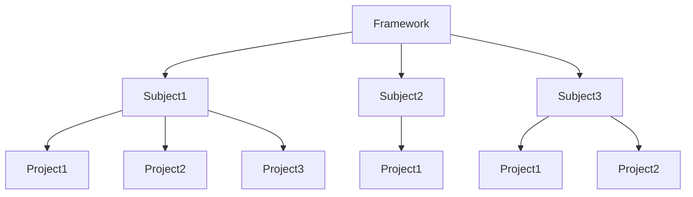

<!--  -->

<!-- HTML Formatting -->
<h1 align="center">
    
</h1>

<p align="center">
    <i style="font-size:20px">HerpTest - The Python Instructional Test Suite System</i>
</p>

<p align="center">
    <i>A test suite built to facilitate testing student programs for teachers</i>
</p>

<p align="center">
    <a href="https://github.com/RobertKilkenny/herptest_UFSA23/blob/master/LICENSE">
        
    </a>
    <a href="https://github.com/RobertKilkenny/herptest_UFSA23.git">
        
    <a>
</p>

<!-- ## <TAGLINE> -->

<!-- Static Badge -->
<!--
[](https://github.com/RobertKilkenny/herptest_UFSA23/blob/master/LICENSE)
-->

<!-- Dynamic Badge(s)
[](https://github.com/RobertKilkenny/herptest_UFSA23/blob/master/LICENSE)
[](https://github.com/RobertKilkenny/herptest_UFSA23.git)
-->

# Table of Content
- [Installation](#installation)
- [Getting Started](#getting-started)
- [Instuctions](#instructions)
    - [Herp-Canvas](#herp-canvas)
      - [Pull](#pull)
      - [Push](#push)
    - [Elma](#elma)
    - [Herp](#herp)
    - [Moss](#moss)
      - [Directories](#directories)
- [Project Structure](#project-structure)
    - [HerpTest Toolbox (herptest.toolbox)](#herptest-toolbox-herptesttoolbox)
    - [Extracting LMS Archives (elma)](#extracting-lms-archives-elma)
    - [Running Unit Test Suite (herp)](#running-unit-test-suite-herp)
    - [Graphical Interface (herp-gui)](#graphical-interface-herp-gui)
      - [Run HerpTest](#run-herptest-herp-gui)
      - [Test Results](#test-results-herp-gui)
      - [Canvas Uploader](#canvas-uploader-herp-gui)
      - [Auto-Pull & ELMA](#auto-pull-&-ELMA-herp-gui)
    - [HerpTest Canvas Interface (herp-canvas)](#herptest-canvas-interface-herp-canvas)
    - [Measure Of Software Similarity (moss)](#measure-of-software-similarity-moss)
- [Under the Hood](#under-the-hood)
    - [Config Class](#config-class)
    - [Test Set Class](#test-set-class)
- [Upload](#upload)
- [License](#license)
- [Credits](#credits)

<br></br>

# Installation
```bash
# Clone the repository
git clone https://github.com/RobertKilkenny/herptest_UFSA23.git

# Change to the project directory
cd herptest_UFSA23

# Build the python module
python3 setup.py sdist bdist_wheel

# Install the module with pip
pip install dist/herptest-<version>.tar.gz

# Confirm installation
herp -V
```

> **ATTN:**
> `herptest` is meant to be installed in a linux environment!

> **ATTN:**
> It is suggested to create a python `venv` before installing the module

> **Note:**
> `"<version>"` is a number in the format `[0.#.#.##]`

> **ATTN:**
> It is suggested to create a python `venv` before installing the module
<!-- >> `"<version>"` is a number in the format `[0.MAJOR.MINOR.PATCH]` -->
<br></br>

# Getting Started
Type `'herp'` in the `root` directory of the below file structure via the terminal

A general workflow when using `herptest` is as follows:
1. Pull Student submissions from the LMS [`herp-canvas`]
2. Extract the submissions from the LMS archive to a submissions directory [`elma`]
3. Evaluate the submissions through a test suite [`herp`]
4. Check for indications of student-to-student plagiarism [`moss`]
5. Push graded student performance(s) to the LMS [`herp-canvas`]

<br>

# Instructions
```bash
.
├── Projects
│   ├── Empty
│   │   └── Program.py
│   ├── Solution
│   │   └── Program.py
│   └── <student>
│       └── Program.py
├── Settings
│   ├── __pycache__
│   │   ├── config.cpython-310.pyc
│   │   ├── config.cpython-38.pyc
│   │   ├── project.cpython-38.pyc
│   │   ├── tests.cpython-310.pyc
│   │   └── tests.cpython-38.pyc
│   ├── config.py
│   └── tests.py
└── Source
    ├── Framework
    │   └── Program.py
    └── Subject
```
> Above is the recommended file structure of a test suite:

> **Note:**
> `"<student>"` is the folder for the student that will be submitting. (there may be multiple)

<br>

## Herp-Canvas

<br>

`'herp-canvas'` will initiate a series of prompts for the user to select a course > assignment to either push grades to or pull student submissions from Canvas.

<br>

### Pull

<br>

> If the `pull` option is selected, a `submissions` directory and LMS archive file (i.e. submissions.zip) will be created at the current directory. A relative path can be provided to change the location the 'submissions' directory is made.

<br>

### Push

<br>

> If the `push` option is selected, the _relative_ or _absolute_ path to a `summary.csv` file must be provided to push grades to canvas.

'Push' gives you the option to set a late policy to be applied to the scores within the selected 'summary.csv' file. To create a valid late policy, enter in a space separated list of float values that correspond to the percent grade deducation per day late of the submission. Ex. [10 20 30] represents that an assignment will be deducted 10% for being one day late, 20% for two days, and 30% for three or more days. [10a b 4] is an invalid late policy and you will be prompted to enter a valid policy before grades can be submitted. 

Note: The late policy field accepts negative and >100 values. If no text is entered in the field, no points will be deducted for late submissions (equivalent to a [0 0 0 ...] entry).

<br>

## Elma

<br>

`'elma'` needs to be provided the LMS archive (i.e. submissions.zip) and a destination to extract it's contents.

<br>

> **Note**
> It is suggested to make the destination `Projects` in the test suite directory
```
elma ./submissions.zip ./Projects
```

<br>

## Herp

<br>

Run `'herp'` in the `root` directory of the test suite

<br>


After running `'herp'`, the `Build` and `Results` directories will be created. The `Results` directory will contain the `summary.csv` along with directories for each graded student. Each student directory will contain a `result.csv` with information of their test case performance for a test suite.

<br>

## Moss

<br>

`'moss'` needs a programming language provided (i.e. python) as an argument.

> **ATTN:**
> Two directories must be provided!

> **Note:**
> By default `basefiles` and `submissions` are set

<br>

After `moss` is ran, a `report.html` file should be created in the current directory. Opening this in a web browser (i.e Google Chrome, Firefox, Microsoft Edge) will display any similarities found in the `submissions` directory.

<br>

### Directories
* `Basefiles` - a directory that holds instructor provided source files which has code that will be omitted in the similarity check
* `Submissions` - a directory that holds the student submissions which will be subject to similarity checks

> **ATTN:**
> There must be _`at least one source file`_ in the `basefiles` directory that is _`not empty`_. Lastly, the student source files **`must have the same name as the base source file`** in separate student directories within the `submissions` directory.

> **Note:**
> It is strongly suggested to use `elma` to extract students submissions from an LMS archive to a `submissions` directory. Also, there **`must be at least two student submissions`** for there to be any meaningful similarity checks.

<br>

```bash
.
├── basefiles
│   ├── a01-base.py
│   ├── b01-base.py
│   └── c01-base.py
└── submissions
    ├── sample_01
    │   └── a01-submission.py
    ├── sample_02
    │   └── a02-submission.py
    ├── sample_03
    │   └── a03-submission.py
    ├── sample_04
    │   └── b01-submission.py
    ├── sample_05
    │   └── b02-submission.py
    ├── sample_06
    │   └── c01-submission.py
    └── sample_07
        └── c02-submission.py
```

<br><br>

# Project Structure
This package includes six primary tools:

- `herptest.toolbox`: Standardized / Cross-platform function calls.
> (Currently only library loading)
- `elma`: (E)xtract (LM)S (A)rchive - A command line tool to extract student submissions.
> (Support is currently limited to Canvas)
- `herp`: A command line tool to run a project test suite as specified by the user.
- `herp-gui`: a GUI tool that interfaces with the CLI herptest functions
- `herp-canvas`: a CLI interface to Canvas in order to push/pull student submissions
- `moss`: a CLI tool to run Stanford Moss similarity checking on student submissions

<br></br>

## HerpTest Toolbox (`herptest.toolbox`)

The toolbox includes the following helper functions, intended to be cross-platform:

`loadTempLibrary(directory, name)`
Returns library loaded with temporary filename; this is necessary on some systems to avoid name collisions.

`loadLibrary(directory, name)`
Returned regularly loaded library

`unloadLibrary(library)`
Unloads the library passed as a parameter

`findLibrary(directory, name)`
Attempts to find any valid version of the library, name-wise (lib, so, etc)

`loadModule(filename)`
Loads a Python module from the supplied filename and returns it.

<br></br>

## Extracting LMS Archives (`elma`)
The `elma` tool will extract a mass-download archive file from LMS systems (such as Canvas) to a submissions directory,
accounting for common renaming schemes and potential student name collisions.

```
usage: elma [-h] [-z] filename destination

Unzips submissions from LMS. Defaults to Canvas format.

positional arguments:
  filename       submissions zip file
  destination    where to extract submissions to

options:
  -h, --help     show this help message and exit
  -z, --zybooks  process ZyBooks archive (default: False)
```

<br></br>

## Running Unit Test Suite (`herp`)

The `herp` command will begin the running of unit tests of all target project. It can take the following arguments:
```
usage: herp [-h] [-V] [-t] [-q] [-w] [-d] [-s SET] [suite_path] [target_path]

A program to run a set of tests for a programming assignment.

positional arguments:
  suite_path         path of test suite to load
  target_path        path of target projects (by subdirectory)

options:
  -h, --help         show this help message and exit
  -V, --version      show program's version number and exit
  -t, --threaded     use threads instead of processes
  -q, --quiet        execute in quiet mode (console)
  -w, --warn         display warning information (console)
  -d, --debug        capture debug information (logfile)
  -s SET, --set SET  test only projects designated (e.g., *_LATE*)
```

<br></br>

## Graphical Interface (`herp-gui`)

The `herp-gui` command will initiate the gui for herptest.

The herp gui has four tabs which contain the functionality of the 'herp', 'elma', and 'herp-canvas'. They are as follows:
1. [Run HerpTest](#run-herptest-herp-gui)
2. [Test Results](#test-results-herp-gui)
3. [Canvas Uploader](#canvas-uploader-herp-gui)
4. [Auto-Pull & ELMA](#auto-pull-&-ELMA-herp-gui)

> **ATTN:**
> Additional OS packages may need to be installed (especially for a newly installed WSL2)

```bash
# Install OS dependencies

sudo apt install '^libxcb.*-dev' libx11-xcb-dev libglu1-mesa-dev libxrender-dev libxi-dev libxkbcommon-dev libxkbcommon-x11-dev
```

<br></br>

### Run HerpTest (`herp-gui`)

The 'Run HerpTest' tab mimics the funcionality of the 'herp' CLI command, taking in test suite and submissions paths as arguments and outputting the resulting grades.

Steps to run:
1. Change the first path to the test suite directory using the "Browse" button (i.e. test_area).
2. Change the path to the Project directory using the "Browse" button (i.e. test_area/Projects).
3. Click on the "Run Tests" button.

The center box will display the 'herp' command running as it would in the command line, providing updates on submissions as they are graded.

You can view the test results either by selecting the "Open Results" button or the "Test Results" tab.

<br></br>

### Test Results (`herp-gui`)

The 'Test Results' tab displays each result generated from running a test suite and a set of test statistics that describe the scores of every submission.

To load the submission data, use the "Browse" button to select the generated summary.csv file and then press the "Load" button.

By selecting an entry in the Show Details column in a populated Test Results, you can view the individual scores for each test in the test suite.

Additional statistics for the test suite can also be viewed in the Test Statistics section. The following statistics for scores are shown: mean, highest, lowest, median, 1st quartile, 2nd quartile, 3rd quartile, standard deviation.

<br></br>

### Canvas Uploader (`herp-gui`)

The 'Canvas Uploader' tab allows for test suite results to be uploaded to Canvas as grades for each student submission.

To use, first go to the "List of Courses" field, and select "Expand ->" for the desired course. In the Assignments for "Course Name" field, you can either return to the "List of Courses" field by selecting "<- Return to Courses" or you can select on any of the visible assignments in the course.

After selecting an assignment, click on the "Browse" button and choose the path corresponding to the 'summary.csv' file generated by 'herp' for the selected assignment. 

'Canvas Uploader' gives you the option to set a late policy to be applied to the scores within the selected 'summary.csv' file. To enter a valid late policy, select the "Specify late policy" field and enter in a space separated list of float values that correspond to the percent grade deducation per day late of the submission. Ex. [10 20 30] represents that an assignment will be deducted 10% for being one day late, 20% for two days, and 30% for three or more days. [10a b 4] is an invalid late policy and you will be prompted to enter a valid policy before grades can be submitted. 

Note: The late policy field accepts negative and >100 values. If no text is entered in the field, no points will be deducted for late submissions (equivalent to a [0 0 0 ...] entry).

Note: The summary.csv should be located in the Results directory (i.e. test_area/Results) after the test suite directory after the test suite was ran.

Clicking the "Upload" button will upload the grades to Canvas for the selected assignment/submissions.

Note: The Upload button will not be clickable until a summary.csv file is selected.

<br></br>

### Auto-Pull & ELMA (`herp-gui`)

The 'Auto-Pull & ELMA' tab allows for the Canvas submissions for any course assignment to be downloaded and then converted into a usable format by herp via the 'elma' command.

To use, first go to the "List of Courses" field, and select "Expand ->" for the desired course. In the Assignments for "Course Name" field, you can either return to the "List of Courses" field by selecting "<- Return to Courses" or you can select on any of the visible assignments in the course. (same as 'Canvas Uploader')

After selecting an assignment, click on "Download Submissions for Selected Assignments" in order to pull the submission from Canvas into the selected path chosen via the "Browse" button (defaults to current directory).

The submissions from the assignment will be downloaded both into a directory labeled 'submissions' and as a zip file labeled 'submissions'.

To convert these submissions into a usable format, use the "Browse" buttons by the "ELMA Source File" and "ELMA Destination" fields to select the locations of the "submissions.zip" file and the test suite projects folder, respectively. Clicking on "Run ELMA on the Selected ZIP Archive" will run the 'elma' command based on these specfications.

<br></br>

## HerpTest Canvas Interface (`herp-canvas`)

The `herp-canvas` command provides a CLI interface to an LMS (Canvas specifically) in order to push grades up to or pull submissions down from.

```
usage: herp-canvas [-h] [-S]

A program to automatically push grades or pull submissions to a Canvas assignment

options:
  -h, --help          show this help message and exit
  -S, -s, --setupenv  Run the setup wizard for Canvas API Key Environment Variables
```

<br></br>

## Measure Of Software Similarity (`moss`)

The `moss` command will initiate the gui for herptest.

```
usage: moss [-h] [-V] [-S] [language] [basefiles] [submissions]

A program to run Stanford moss on student submitted projects. Operates by taking in folder of base files and folders of submissions, positional arguemnts: language, basefiles, submissions

positional arguments:
  language            language to test with
  basefiles           path of folder containing base files that you provided to students (default ./basefiles)
  submissions         path of folder containing student submissions (default ./submissions)

options:
  -h, --help          show this help message and exit
  -V, -v, --version   show program's version number and exit
  -S, -s, --setupenv  Run the setup wizard for MOSS API Key Environment Variables
```

<br></br>

# Under the Hood

## Test Suite Topology
Upon startup, the `herp` utility will optionally initialize the framework specified in the settings. This framework is
only built and initialized once for all students; any items that must be rebuilt for each student should be handled on
an per-subject (student) basis. The herp utility provides a mechanism to initialize and clean up at the framework,
subject, and project level (where there is one framework used to test many subjects, and each subject has one or more
projects that are tested individually.)


<br></br>
## Config Class

The test suite is identified by a `config.py` file that is loaded as a module. The config file must provide--at minimum--the following function:

  ```python
  def get_suite_config(runtime: argparse.Namspace) -> herptest.Config
  ```

The Config class is defined as follows:

```python
__init__(self, runtime=None: argparse.Namespace, test_sets=None: tuple(herptest.TestSet, ...), **keywords)
```

    Named Arguments
    ---------------
    runtime:   arguments passed at runtime
    test_sets: tuple of TestSet objects defining the set of tests for subsections of the target
    
    Keyword Arguments
    -----------------  
    result_path:  Directory where results of tests should be stored. Defaults to "Results".
    result_file:  CSV file name for storing test results (one per subject). Defaults to "result.csv".
    error_log:    Error log file name (one per subject and overall). Defaults to "error.log".
    summary_file: CSV file name for storing summary of subject tests results. Defaults to "summary.csv".

    Any other key-value pairs will be added directlu to the object as attributes (for custom data elements).

The Config class includes a key-value store for build parameters (self.build). The keys can be accessed as attributes
(e.g., build.foo = "bar"). All keys default to the Python "None" value. The pre-determined keys are as follows:

```
  base:          location of any base code to be copied into subject destination folder before the subject code
  destination:   location where base, then subject, files should be copied in preparation fo building
  
  framework_src: location of framework source to be built
  framework_bin: location where framework code should be built (e.g., where object / executable files go when compiled)

  subject_src:   location of subject source to be built (often the same as "destinaton")
  subject_bin:   location where subject code should be built (e.g., where object / executable files go when compiled)

  prep_cmd:      one, or a sequence of, command(s) to be executed in preparation for compile (beforehand).
  compile_cmd:   one, or a sequence of, command(s) to be executed as part of the compilation process.
  post_cmd:      one, or a sequence of, command(s) to be executed after the compilation has been completed (afterward).

```

  Each command is a sequence (e.g., list) constructed as follows:

```
  (execution_command, *parameters)

The following optional methods in Config may be overloaded:

  initialize_framework(self) -> framework_context
  Called after building the framework. It should return any framework_context that is important to properly shutdown /
  cleanup the framework. By default, executes no instructions but returns "None".

  shutdown_framework(self, framework_context)
  Clean up / shutdown the framework. This method will be called when all testing is done. The context passed in is
  identical to that returned by the initialize_framework method. Default implementation is no-op.

  initialize_subject(self, subject_bin, framework_context) -> subject_context
  Called after subject project(s) are built but before testing. In addition to the framework context, it is passed the
  subject output (binary) directory. It should return any subject_context important to properly shutdown / cleanup once
  all of the subject's project tests have been completed. By default, executes no instructions but returns subject_bin.

  shutdown_subject(self, subject_context)
  Clean up / shutdown the testing subject. This method is called when testing is done for subject. The subject_context
  passed in is identical to that returned by the initialize_subject method. Default implementation is no-op.

  initialize_test_set(self, test_set, subject_context, framework_context) -> test_set_context
  Called by test suite to prepare a set of tests to be run on this subject. In addition to other contexts, the current
  TestSet object (test_set) is passed to the call. It should return any test_set_context that is important to properly
  shutdown / cleanup the test set after testing is completed. By default, executes no instructions but returns test_set.
  
  shutdown_test_set(self, test_set_context)
  Clean up / shutdown the test set for the current subject. This method is called when test set is done for subject. The
  test_set_context passed in is identical to that returned by initialize_test_set. Default implementation is no-op.
```

## Test Set Class

The TestSet class is defined as follows:

```
  __init__(self, name: str, id: str, num_tests: int | Callable, test_function: Callable, **keywords)
```
    Required Arguments
    ------------------
    name:          plain-language name for the test set for visual display
    id:            shorthand string for test set (ASCII only, alpha-numerics and/or underscores - e.g., [A-Ba-b0-9_]*)
    num_tests:     the number of tests as an integer or a callable that returns the number of tests as an integer.
    test_function: a callable that returns a value of 0-1 to score the subject on the given test.
    
    The test_function parameter should act as a function with the following signature:
      test_function(test_num, test_set_context, subject_context, framework_context, config) -> float, ValueRange(0, 1)

    Keyword Arguments
    -----------------
    max_score:   Maximum score for this test set. Defaults to 100.0
    max_penalty: Maximum penalty that can be applied to the project. Defaults to 0.0
    test_desc:   Callable: test_desc(teset_num, *args, **keywords) -> description: str. Defaults to "Test #{test_num}"

TestSet has the following methods:

```
  add_case_penalty(self, name: str, fraction: float, function: Callable)
  Adds a case-test penalty (run once per test case) evaluation (empty by default).

  add_set_penalty(self, name: str, fraction: float, function: Callable)
  Adds a test set penalty (run once per test set) evaluation (empty by default)

  Penalty functions have the following signature:
    case_penalty(pen_num, test_num, test_set_context, subject_context, framework_context, config) -> float (max of 1)
    set_penalty(pen_num, test_set_context, subject_context, framework_context, config) -> float (max of 1)
```

TestSet has the following properties:
```

  name:           name of TestSet (readonly)
  id:             id of TestSet (readonly)
  num_tests:      number of tests in test set (readonly)
  max_score:      maximum overall score of test set (readonly)
  case_penalties: case-test penalties as a list of tuples (name, fraction, function) (readonly)
  set_penalties:  test-set penalties as a list of tuples (name, fraction, function) (readonly)
  max_penalty:    maximum overall penalty that can be applied to the score (readonly)
```

<br></br>

# Upload
Called after building the framework. It should return any framework_context that is important to properly shutdown /--

```bash
# Upload Module to PyPi

twine upload dist/herptest-<version>.tar.gz
```

<br></br>

<!-- 
# Contribution Instructions
# Contribution Expectations
# Known Issues
-->

# License

HerpTest is licensed under the terms of the GPL Open Source license and is available for free.

<br></br>

# Credits
```
Team Suite Life - CIS 4930 - Python Term Project
- Jack Kilkenny
- Robert Mezardieu
- Lunafreya Nyugen
- Renee Kaynor

Prior Contributors (pengtest Team)
- Tyler Maiello
- Emma Andrews
- Matthew Baumaister
- Matthew McDermott
- Gerard Avecilla
```